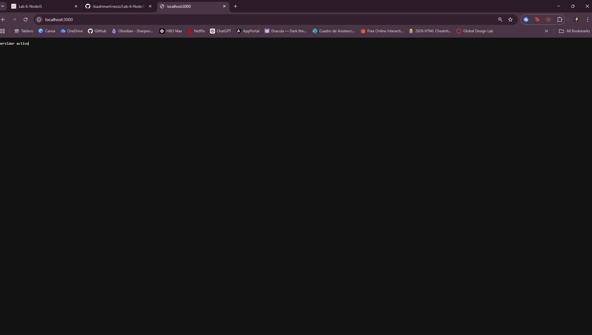
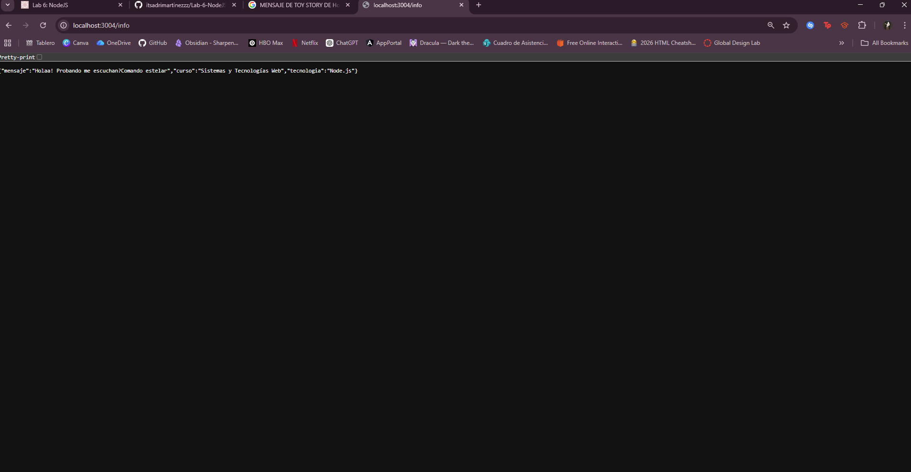
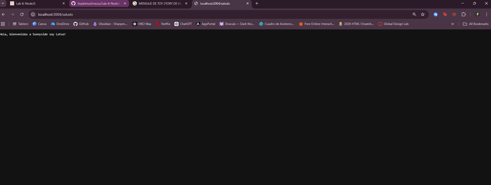
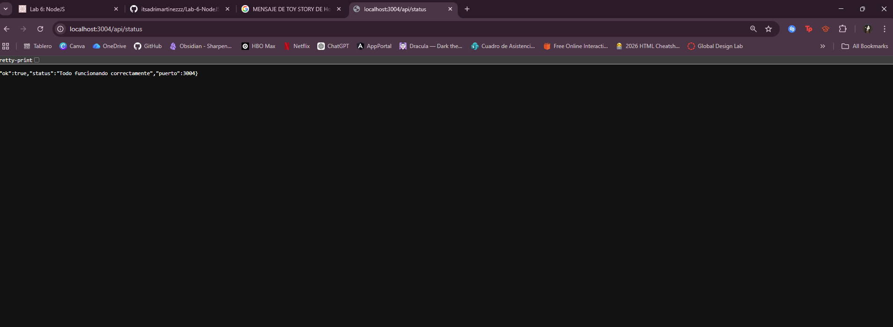
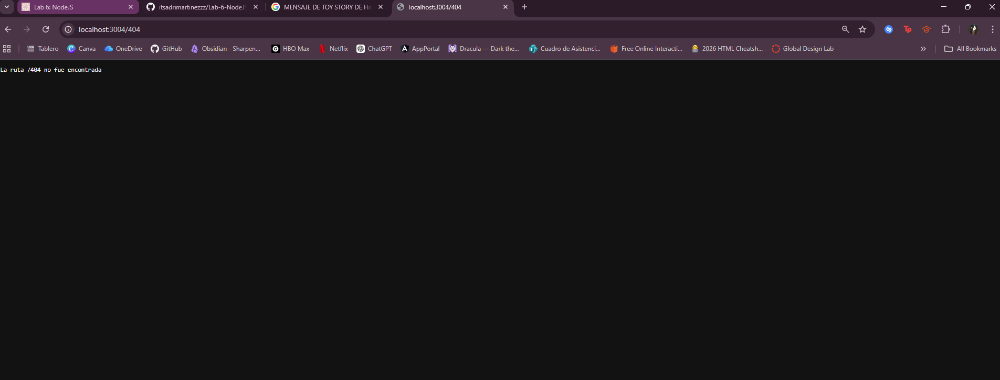

# Laboratorio 6
# Parte 1
## Correcciones en servidor-malo.js

Para esta parte se ejecuto el archivo `servidor-malo.js` y se fue probando las rutas para ver qué estaba mal

## Errores encontrados

## Error 1: Content-Type mal escrito en /info
El primer error fue que el `Content-Type` estaba mal escrito como `application-json`, lo cual era válido

### Solución:
Se cambió a `application/json`

---

## Error 2: faltaba await al leer el archivo
En la ruta `/api/student`, el archivo `datos.json` se estaba leyendo sin `await`, entonces no se obtenía bien la información

### Solución:
Se agregó `await` en la lectura del archivo

---

## Error 3: no se estaba convirtiendo a JSON
Después de leer el archivo, el contenido no se estaba convirtiendo a JSON antes de enviarlo

### Solución:
Se utilizó `JSON.parse(texto)` para convertirlo y luego `JSON.stringify(datos)` para enviarlo

---

## Error 4: código incorrecto en ruta no encontrada
Cuando se accedía a una ruta que no existía, el servidor respondía con código `200` en lugar de `404`

### Solución:
Se cambió el código de estado a `404`

---

## Error 5 y 6: error al cerrar el servidor
El callback de `createServer` no estaba cerrado correctamente, lo que causaba un error de sintaxis

### Solución:
Se corrigió el cierre agregando el paréntesis faltante

---

## Resultado


# Parte 2

Ya con el servidor funcionando en la parte 1, se le realizaroncambios para agregar nuevas rutas

También cambié el puerto a 3004 porque ya tenía ocupado el 3000 con la parte anterior

## Cambio 1: Ruta `/info`

Antes esta ruta solo devolvía texto, ahora devuelve un JSON con la información que se pidió

- mensaje  
- curso  
- tecnologia  




---
## Cambio 2: Ruta `/saludo`

Se creó una nueva ruta `/saludo` que devuelve texto. Le puse un mensaje inspirado en Toy Story porque estaba viendo la peli XD




---

## Cambio 3: Ruta `/api/status`

Se creó una nueva ruta `/api/status` que devuelve un JSON con

- ok  
- status  
- puerto  




---

## Cambio 4: Mejora del 404

Ahora cuando una ruta no existe, el servidor muestra cuál fue la ruta que el usuario intentó visitar y que no existe 




---

## Rutas probadas

Estas fueron las rutas que probé en el navegador

```txt
http://localhost:3004/
http://localhost:3004/info
http://localhost:3004/saludo
http://localhost:3004/api/status
http://localhost:3004/noexiste